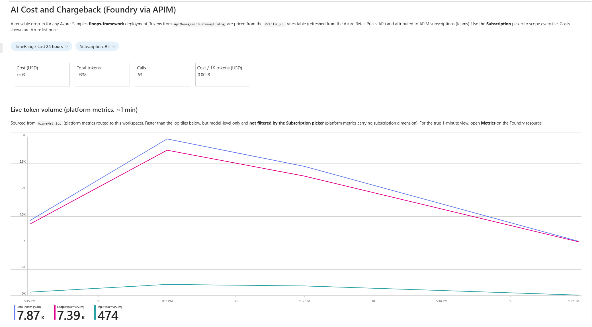
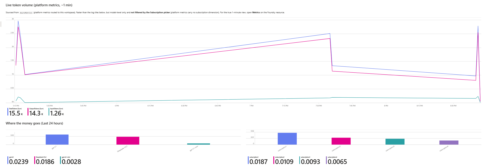
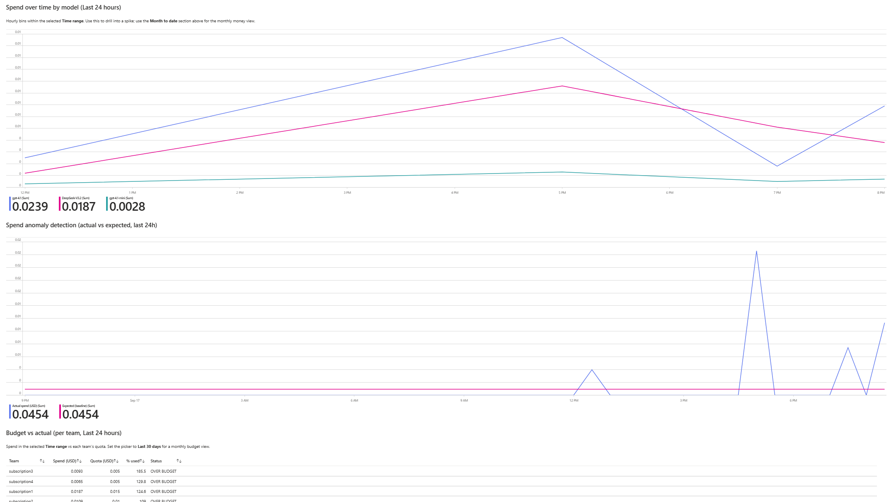
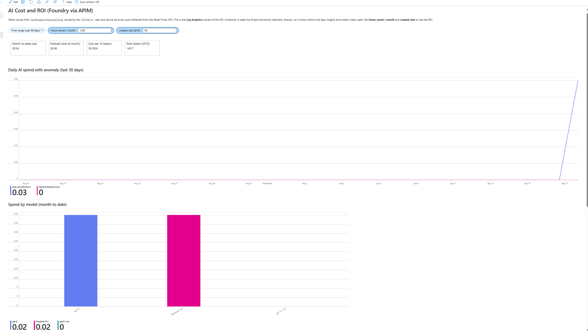
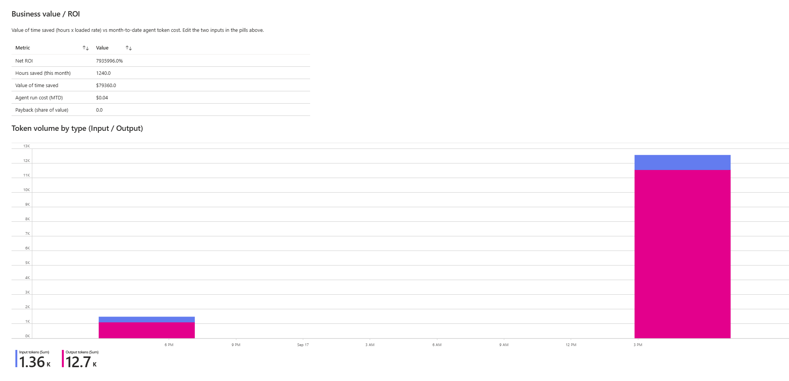
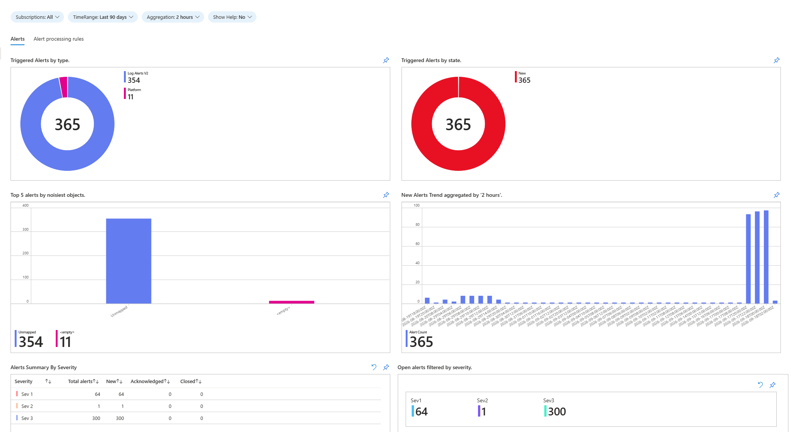

# Foundry Cost & ROI Dashboard

Turn Azure AI Foundry / Azure OpenAI **token telemetry into dollars, chargeback, and ROI**.
Azure Monitor gives you token *counts*; this adds a **rate card** to turn them into *dollars*, a
per-team chargeback dimension, budget-vs-actual, and an ROI panel. It fills the Foundry cost gap
that Copilot-focused tools (Consumption Central, ValueLens) do not cover.

Use it two ways:

- **Deploy the whole platform** from [`infra/`](infra/): an APIM AI gateway, per-team token
  throttling, budget auto-disable, Foundry model deployments, and the workbooks. No external
  accelerator required.
- **Drop the workbooks** into an APIM + Log Analytics gateway you already run.

## Scope and how it fits

This is the **AI operational economics layer**: near-real-time tokens, estimated cost, model/team
breakdown, anomalies, quotas, and ROI. It is not a complete financial system, position it alongside
your billing system, not instead of it.

- **What it covers:** Foundry / Azure OpenAI traffic **routed through the APIM gateway**. Team
  attribution comes from the APIM subscription, so it only sees traffic that carries an APIM key.
- **What it does not cover:** two separate things. First, your own Foundry / Azure OpenAI traffic
  that **bypasses APIM** or runs on a resource **without the token-logging policy**; route it through
  the gateway (or add the policy) and it shows up here. Second, the **Copilot products** (Microsoft
  365 Copilot, GitHub Copilot, Copilot Studio), which are Microsoft-run SaaS: their model calls
  **never traverse your APIM**, so this dashboard cannot break them down by token / team / model no
  matter what. Microsoft 365 Copilot and GitHub Copilot are licensed **per seat**; Copilot Studio is
  **consumption-based** (message packs or pay-as-you-go messages). You see their **dollar cost** only
  in their own billing surfaces: the Microsoft 365 admin center, GitHub billing, or Azure Cost
  Management, depending on how each is licensed.
- **Estimate, not invoice.** Cost here is tokens x rate card at Azure **list** price. For billed and
  amortized truth, use Cost Management / a **FOCUS** export and reconcile the two with
  [`queries/07-focus-reconciliation.kql`](queries/07-focus-reconciliation.kql): it derives a per-day
  **calibration factor** (billed / estimated) you apply to the live estimate so it tracks the
  invoice (billed data lags ~24h, so this is next-day calibration).

The strongest architecture is three layers: **this dashboard** (live tokens, estimated cost,
chargeback, anomalies, quotas, ROI) + [**Cost Management**](https://portal.azure.com/#view/Microsoft_Azure_CostManagement/Menu/~/costanalysis) / FOCUS (billed and amortized truth) + a
**reconciliation view** between them.

## What it looks like

The views below are this repo's Azure Monitor workbooks, the **Cost Analysis** and **Foundry Cost &
ROI** workbooks (the Log Analytics ones deployed by [`infra/`](infra/)), plus the stock **Alerts**
workbook. They are the live-token and estimated-cost layer; billed dollars live in
[Cost Management](https://portal.azure.com/#view/Microsoft_Azure_CostManagement/Menu/~/costanalysis).



*The Log Analytics cost and chargeback workbook ([`workbook/FoundryCostAnalysis-LogAnalytics.workbook`](workbook/FoundryCostAnalysis-LogAnalytics.workbook)).*

Two pickers scope everything: **Time range** and **Subscription** (the APIM subscription = team).
The top **KPI strip** shows total cost, total tokens, calls, and cost per 1K tokens for the selected
range. The **Month to date** section is a fixed calendar-month view: spend so far, a run-rate
projected month-end, average per day, and a per-day + cumulative **burn-up**. Further down (next
images) are live token volume, spend by model and by team, spend over time, anomaly detection,
budget vs actual, a PRICE MISSING data-quality tile, token split, and a top-consumers table.



*Live token volume from platform metrics (about 1 minute), and where the money goes: spend by model and by subscription (chargeback).*



*Spend over time by model, spend anomaly detection (actual vs expected), and budget vs actual per team with an OVER BUDGET / Warning / OK status.*

### Foundry Cost & ROI workbook



*The Log Analytics ROI variant ([`workbook/FoundryCostRoi-LogAnalytics.workbook`](workbook/FoundryCostRoi-LogAnalytics.workbook)): month-to-date cost, run-rate forecast, cost per 1K tokens, and total tokens; a daily spend + anomaly trend; and spend by model. Three pills, **Hours saved / month**, **Loaded rate ($/hr)**, and **Platform cost / month**, size the ROI.*



*Business value / ROI (value of time saved = hours x loaded rate, vs month-to-date run cost: model tokens plus an optional platform-cost input) and token volume split into input vs output. Net ROI reads **n/a** below $1 of monthly spend, so a few cents of lab traffic does not show a meaningless multi-million-percent figure. See [ROI model](docs/roi-model.md) for what the inputs mean and the exact math.*

### Alerts workbook (operational)



The **Alerts workbook** is a stock operational workbook deployed alongside the cost views (it is
not a cost tile). It is Azure Monitor's inventory of **alerts that fired** in the subscription over
the selected window, so you can confirm your **budget-enforcement rules** and **token-spike alerts**
are actually firing. In this example (last 90 days) there are 365 alerts:

- **By type:** 354 **Log Alerts V2** (the `alert-suspend-subscriptions` / `alert-activate-subscriptions`
  scheduled-query rules that drive the budget auto-disable, evaluating every 5 minutes and firing when
  a team crosses or drops back under its cost quota) plus 11 **Platform** metric alerts (for example the
  token-spike alert).
- **By state:** all 365 are **New**, because nothing was acknowledged or closed.
- **Noisiest object:** "Unmapped" (354), because log-query alerts do not attach to a single resource.
- **Trend:** the burst at the right is when test traffic pushed the deliberately tiny sample quotas
  over the line, so the suspend/activate rules fired in a flurry.
- **Active Alerts** (bottom table) lists the individual firings, so you can see exactly which rule
  fired, when, and on which object.

In production, set realistic quotas and an **action group** so these rules enforce quietly instead of
generating noise.

## Deploy: two options

Everything is in [`infra/`](infra/). Pick based on whether you already run an APIM gateway. Option A
creates all of the components below; Option B uses your existing gateway and creates only the
workspace-side pieces (tables, DCRs, and the cost + ROI workbooks).

| Component | What it does |
|---|---|
| APIM AI gateway + `inference-api` | Fronts Azure AI Foundry; one endpoint, per-team keys |
| `llm-token-limit` per product | Throttles platinum/gold/silver at different tokens-per-minute and token quotas |
| `azure-openai-emit-token-metric` | Emits token metrics with a team/product dimension |
| Foundry + model deployments | gpt-4.1, gpt-4.1-mini, DeepSeek-V3.2 (edit in `params.json`) |
| `PRICING_CL` + `SUBSCRIPTION_QUOTA_CL` (+ DCRs) | Rate card and per-team budgets |
| Cost Analysis + Foundry Cost & ROI workbooks | Cost/chargeback and ROI views |
| Alerts workbook + dashboard | Operational monitoring |
| Logic App + scheduled-query rules | **Auto-disables** any team that exceeds its cost quota, and re-enables it when spend drops back under |

The infra is adapted from the MIT-licensed Azure-Samples/AI-Gateway project; see [`NOTICE`](NOTICE)
for attribution. On top of it, this repo adds the improved cost workbook, the ROI workbook, weekly
rate-card auto-refresh, and the Grafana surface.

### Option A: greenfield (creates a new APIM + Foundry)

Use this on a clean subscription with no gateway yet.

```powershell
# 1. Deploy the platform (creates one APIM in a new resource group)
./infra/deploy.ps1 -Subscription <your-sub-id>

# 2. Populate prices/quotas and generate sample traffic
#    (pip install azure-identity azure-monitor-ingestion requests openai)
python infra/postdeploy.py --subscription <your-sub-id> --resource-group finops-standalone --deployment finops-standalone
```

Edit [`infra/params.json`](infra/params.json) for models, APIM SKU, products, and quotas. Tear
down with `az group delete -n finops-standalone -y`. Resource names come from
`uniqueString(subscription, resourceGroup)`, so deploying into an **existing** finops-framework
resource group reuses that APIM instead of creating a new one.

### Option B: bring your own APIM + workspace (no new APIM)

Use this if you already run an APIM AI gateway and a Log Analytics workspace. It does **not** create
an APIM. Run it in the resource group that holds your workspace.

```powershell
./infra/deploy-existing.ps1 -Subscription <your-sub-id> -ResourceGroup <workspace-rg> -WorkspaceName <workspace-name>
```

Then populate the two tables and confirm your gateway is logging (next section):
- **Rate card:** deploy [`pricing-refresh/`](pricing-refresh/) against the new `dcr-pricing-*` DCR
  (weekly auto-refresh from the Azure Retail Prices API), or seed `PRICING_CL` once.
- **Budgets:** write one `SUBSCRIPTION_QUOTA_CL` row per team (APIM subscription) with its `CostQuota`.

## Requirements: what must exist and be turned on

For the dashboards to show data, this chain has to be in place. **Option A sets all of it up for
you.** For **Option B** you point at what you already have and turn on the gateway logging
(requirements 2 and 3 are the ones people forget).

| # | Requirement | Feeds | How |
|---|---|---|---|
| 1 | An **APIM AI gateway** in front of Azure OpenAI / Foundry, with per-team **subscriptions** | team attribution | your gateway (Option A creates one) |
| 2 | APIM **resource diagnostic** to Log Analytics: `AllLogs` + resource-specific (Dedicated) tables | `ApiManagementGatewayLogs` | APIM > Diagnostic settings; or CLI below |
| 3 | An **`azureMonitor` logger** on APIM + the LLM API's **per-API diagnostic** with `largeLanguageModel.logs = enabled` | `ApiManagementGatewayLlmLog` (token counts) | API > Settings > Diagnostics logs (Azure Monitor), turn on **LLM logs** |
| 4 | **`PRICING_CL`** table populated (rate card) | dollars | Option A postdeploy, or [`pricing-refresh/`](pricing-refresh/) auto-refresh |
| 5 | **`SUBSCRIPTION_QUOTA_CL`** table populated | budget vs actual tile | one row per team with `CostQuota` |
| 6 | *(optional)* Foundry/AOAI **resource diagnostic** to the workspace (`AllMetrics`) | the **Live token volume** tile (`AzureMetrics`) | Foundry resource > Diagnostic settings |
| 7 | *(optional)* APIM **`azure-openai-emit-token-metric`** policy + an App Insights diagnostic | the App-Insights ROI variant (`customMetrics` / `AppMetrics`) | see [`enablement/`](enablement/) |
| 8 | **Reader** on the workspace to view; **Monitoring Metrics Publisher** on the DCRs to ingest prices/quotas | - | RBAC |

Turn on gateway logging for an existing APIM (requirements 2 and 3):

```powershell
# 2. Route APIM logs to your workspace as resource-specific (dedicated) tables
az monitor diagnostic-settings create --name finops-dashboards `
  --resource <apim-resource-id> `
  --workspace <workspace-resource-id> `
  --logs '[{"categoryGroup":"allLogs","enabled":true}]' `
  --metrics '[{"category":"AllMetrics","enabled":true}]' `
  --export-to-resource-specific true

# 3. Turn on LLM logging (portal is easiest):
#    APIM > APIs > <your Azure OpenAI API> > Settings > Diagnostics logs > Azure Monitor >
#    enable, select an azureMonitor logger, and turn ON the Large language model (LLM) logs.
```

Without requirements 2 and 3, `ApiManagementGatewayLlmLog` is empty and every cost tile reads zero.

## The workbooks

Three workbooks are included; the first two are what `infra/` deploys.

| File | Reads from | Best for |
|---|---|---|
| [`workbook/FoundryCostAnalysis-LogAnalytics.workbook`](workbook/FoundryCostAnalysis-LogAnalytics.workbook) | Log Analytics `ApiManagementGatewayLlmLog` priced from `PRICING_CL` | Chargeback + budget vs actual |
| [`workbook/FoundryCostRoi-LogAnalytics.workbook`](workbook/FoundryCostRoi-LogAnalytics.workbook) | Log Analytics `ApiManagementGatewayLlmLog` priced from `PRICING_CL` | ROI + unit economics, no extra plumbing |
| [`workbook/FoundryCostRoi.workbook`](workbook/FoundryCostRoi.workbook) | App Insights `customMetrics` (APIM `llm-emit-token-metric`) | ROI when you already emit token metrics to App Insights |

The **Cost Analysis** workbook (Log Analytics) is the main one: a KPI strip (cost, tokens, calls,
cost per 1K), month-to-date spend + forecast + burn-up, spend by model, spend by team (chargeback),
spend over time, **anomaly detection** (actual vs expected), a **live token tile** from platform
metrics, **budget vs actual** (OVER BUDGET / Warning / OK), a **PRICE MISSING** data-quality tile,
token split, and a top-consumers table. The **Foundry Cost & ROI** workbook adds the ROI panel
(hours saved x loaded rate vs run cost = model tokens plus an optional **Platform cost / month** for
APIM, Log Analytics, App Insights, and Foundry hosting; Net ROI reads **n/a** below $1 of spend);
see [ROI model](docs/roi-model.md) for what the inputs mean and how to set them. Costs are Azure list price.

The two **Log Analytics** workbooks are the recommended ones: they read the **`PRICING_CL`** rate
card (auto-refreshed from the Retail Prices API, so no manual price editing), flag unknown
deployments in a **PRICE MISSING** tile instead of guessing a model, and use consistent windows.
[`workbook/FoundryCostRoi.workbook`](workbook/FoundryCostRoi.workbook) is the App Insights
`customMetrics` variant with an inline rate card you maintain in each query; use it only if your
token metrics already flow to App Insights via `llm-emit-token-metric`.

Just want one workbook in a setup you already run? Import it via **Monitor > Workbooks > New >
Advanced Editor** (replace the `{workspace-id}` placeholder with your workspace resource id first),
or deploy only the cost workbook:

```powershell
az deployment group create -g <rg> --template-file workbook/deploy-cost-analysis-workbook.bicep --parameters workspaceResourceId=<your Log Analytics workspace resource id>
```

## Keep the rate card current (auto-refresh)

`PRICING_CL` holds Azure list prices. To keep it current with **zero editing**, deploy the included
Automation runbook that re-pulls the **Azure Retail Prices API** on a weekly schedule and writes to
the pricing data collection rule:

- [`pricing-refresh/Refresh-PricingCL.ps1`](pricing-refresh/Refresh-PricingCL.ps1): the runbook (managed-identity auth, no keys).
- [`pricing-refresh/deploy-pricing-refresh.bicep`](pricing-refresh/deploy-pricing-refresh.bicep): Automation account + system-assigned identity + weekly schedule + the `Monitoring Metrics Publisher` grant on the DCR.

```powershell
az deployment group create -g <rg> --template-file pricing-refresh/deploy-pricing-refresh.bicep --parameters runbookRawUrl=<raw-url> dcrName=<dcr-name> dcrEndpoint=<dcr-endpoint> dcrImmutableId=<dcr-immutable-id> meterMapJson=<model-to-meter-json>
```

The only thing to maintain is the **model-to-meter map** (the Retail Prices API meter names do not
equal deployment names); the workbook's PRICE MISSING tile flags anything unmapped.

## Architecture (the telemetry model)

```
Azure AI Foundry / Azure OpenAI ──(diagnostic settings: AllMetrics + logs)──► Log Analytics
        │                                                                         ▲
        └──(fronted by)──► APIM AI gateway ──(llm-emit-token-metric: +Team dim)──► Application Insights
                                                                                  │
Cost Management ──(FOCUS export)──► Storage (real billed $, optional)             │
                                                                                  ▼
                                          Azure Monitor Workbook (this repo) ◄─────
                                          + rate card (token -> $) + ROI inputs
```

- **Token counts (free, native):** diagnostic settings on each Foundry/AOAI resource. Native metrics
  include Processed Prompt Tokens, Generated Completion Tokens, Processed Inference Tokens, and
  Prompt Token Cache Match Rate.
- **Per-team attribution:** the **APIM AI gateway** in front, emitting token metrics with a `Team`
  (or app) dimension. See [`enablement/apim-llm-emit-token-metric.xml`](enablement/apim-llm-emit-token-metric.xml).
- **Real billed dollars (optional):** a **FOCUS cost export** gives amortized, invoice-accurate
  cost. Point the daily-spend panel at it instead of the rate card for billed truth.
- **The dollars:** a small **rate card** ([`rate-card/rates.csv`](rate-card/rates.csv)) turns token
  counts into cost.

## Grafana (alternative surface)

Same panels and the same KQL on a Grafana surface (stat cards with colored deltas, value-labeled
bars, stacked bars).

- File: [`grafana/foundry-cost-roi.json`](grafana/foundry-cost-roi.json).
- Import: Grafana -> **Dashboards -> New -> Import** -> upload the JSON.
- Prereqs: the **Azure Monitor** data source (built in to Azure Managed Grafana).
- On import, set the two dashboard variables: your **Azure Monitor data source** and the
  **App Insights resource ID** your APIM gateway emits to.

Rule of thumb: **Workbook** for the free in-portal ops view, **Grafana** for a polished
real-time / exec view, **Power BI** (FinOps toolkit) for billed-dollar finance reporting. Power BI
shows AI *dollars* (filter Service = Azure OpenAI) but not tokens or unit economics, which is what
this workbook / Grafana layer adds.

## Governance and quality (optional)

Everything routes through **one APIM AI gateway into one Application Insights / Log Analytics**, so
cost, data-governance, and quality telemetry share the **same store and the same dimensions**
(`ModelDeploymentName`, `Team`, `ApiId`, operation id). That lets you put cost next to governance
and quality in one place. Pair the cost view with **Purview** (is the spend *safe*?) and **Foundry
evals** (is the spend *good*?):

| Layer | Produces | Lands in | Joins to cost on |
|---|---|---|---|
| Cost (this repo) | token counts x rate card = $ | App Insights `customMetrics` | `ModelDeploymentName`, `Team` |
| Purview DLP | sensitive-data hits, blocked / flagged requests | App Insights / APIM gateway logs | `ModelDeploymentName`, `Team`, `ApiId` |
| Foundry evals + tracing | groundedness / relevance / safety scores, agent traces, escalations | App Insights `traces` / `customEvents` | operation id, deployment |

**Cost driver vs DLP risk per team** (adjust the DLP event name/source to your logging):

```kusto
let cost = customMetrics
  | where name in ("Prompt Tokens","Completion Tokens")
  | extend team = tostring(customDimensions.Team)
  | summarize Tokens = sum(valueSum) by team;
let dlp = customEvents
  | where name == "PurviewDlpBlocked"          // <-- your Purview / APIM DLP event name
  | extend team = tostring(customDimensions.Team)
  | summarize DlpHits = count() by team;
cost | join kind=leftouter dlp on team
| project team, Tokens, DlpHits = coalesce(DlpHits, 0)
| order by DlpHits desc, Tokens desc
```

**Cost per passing eval by deployment** (adjust the eval event name to your Foundry export):

```kusto
let rates = datatable(family:string, inK:real, outK:real)["gpt-4o",0.0025,0.010,"gpt-4o-mini",0.00015,0.0006];
let cost = customMetrics
  | where name in ("Prompt Tokens","Completion Tokens")
  | extend dep = tostring(customDimensions.ModelDeploymentName)
  | extend family = case(dep has "mini","gpt-4o-mini", dep has "gpt-4o","gpt-4o", "unmapped")
  | summarize inTok=sumif(valueSum,name=="Prompt Tokens"), outTok=sumif(valueSum,name=="Completion Tokens") by dep, family
  | lookup kind=leftouter rates on family
  | extend CostUsd = (inTok/1000.0*coalesce(inK,0.0))+(outTok/1000.0*coalesce(outK,0.0));
let evals = customEvents
  | where name == "gen_ai.evaluation"          // <-- your Foundry eval event name
  | extend dep = tostring(customDimensions.ModelDeploymentName), passed = tobool(customDimensions.passed)
  | summarize Passing = countif(passed == true), Total = count() by dep;
cost | join kind=leftouter evals on dep
| extend CostPerPassingEval = round(CostUsd / max_of(toreal(Passing), 1.0), 4)
| project dep, CostUsd = round(CostUsd,2), Passing, Total, CostPerPassingEval
| order by CostUsd desc
```

Add either query as a new tile (Workbook) or panel (Grafana) next to the cost tiles: same data
source, same time range, three questions (what does it cost, is it safe, is it good) off the same rows.

## Customize and notes

- **Rates** are illustrative; replace them with your contract prices. The Log Analytics workbooks
  read the `PRICING_CL` table; the App Insights variant uses an inline `rates` datatable mapped by a
  `case()` on `ModelDeploymentName`.
- **Billed vs estimate:** for invoice-accurate dollars, reconcile against a **FOCUS export** with
  [`queries/07-focus-reconciliation.kql`](queries/07-focus-reconciliation.kql) (per-day calibration
  factor), or point the daily-spend / by-model queries directly at the export.
- **Cache hit rate:** if your APIM policy does not emit Cached Tokens, use the native Azure OpenAI
  metric *Prompt Token Cache Match Rate* (see [`queries/04-cache-hit-rate.kql`](queries/04-cache-hit-rate.kql)).
- **Workspace-based App Insights:** the `customMetrics` table is named `AppMetrics`.
- **Continuous integration:** [`.github/workflows/ci.yml`](.github/workflows/ci.yml) compiles the
  Bicep templates and validates every workbook / Grafana JSON on each push and pull request.
- No customer-specific data is included; this is a reusable template.

## License

MIT. See [LICENSE](LICENSE). Vendored infrastructure is MIT (Azure-Samples/AI-Gateway); see [`NOTICE`](NOTICE).
